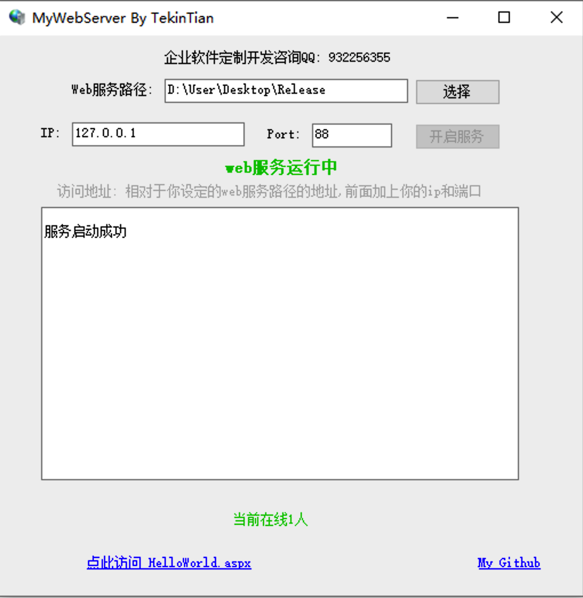
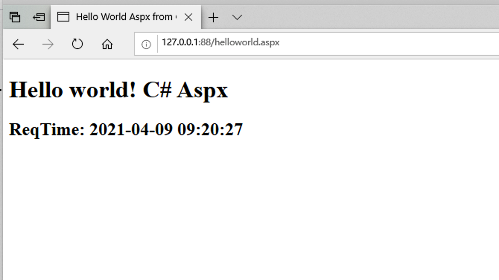

# Mini MyWebServer  C# Web Server

##  迷你版的C# Aspx html web server服务端

支持 自定义服务路径, 绑定IP,和端口;  

支持动态aspx和静态html 网页服务

可执行文件下载: [MyWebServer v1.0.0版本下载](https://wwa.lanzous.com/iRTzEntwoyh)

注意: 本项目依赖 .NET Framework 4.6.1 , 你的电脑需要安装这个运行库

下载地址: https://go.microsoft.com/fwlink/?LinkId=671728

## 运行效果

## .aspx 网页服务运行效果

